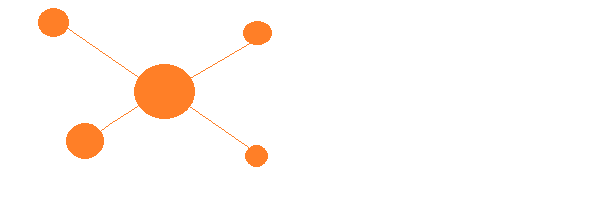

 


[](https://github.com/IaraDB/iaraText/tree/dev)
[](https://opencollective.com/tauri)
[](https://github.com/IaraDB/iaraText/actions/workflows/test-core.yml)


## Introduction
IaraText is a Rust library designed for educational purposes, drawing inspiration from the Lucene project. It aims to provide developers with a powerful toolset for text processing and indexing. With IaraText, users can implement various text-related functionalities with ease.

Similar to Lucene, IaraText offers capabilities for indexing and searching textual data efficiently. Developers can integrate IaraText into their projects to enable functionalities such as full-text search, text analysis, and indexing.

IaraText strives to maintain simplicity and clarity in its design, making it accessible for educational purposes. By leveraging Rust's performance and safety features, IaraText ensures reliable and fast text processing.

With its educational focus and inspiration from Lucene, IaraText empowers developers to explore the intricacies of text processing while benefiting from the robustness of Rust's ecosystem.

## Getting Started

If you are interested in try IaraText, please visit the [documentation](docs/index.md).


```sh
cargo test COMAND_HERE
```


## Contributing

Before diving into a task, it's advisable to first check for any existing issues. Additionally, dropping by the Discord server to verify with the team whether the task aligns with ongoing efforts or if someone else is already handling it is a wise move.

Make sure to review the Contributing Guide before submitting a pull request.

A big thank you goes out to all contributors to IaraText!


## Licenses

Code: (c) 2015 - Present - The IaraText Programme within The Commons Conservancy.

MIT or MIT/Apache 2.0 where applicable.

